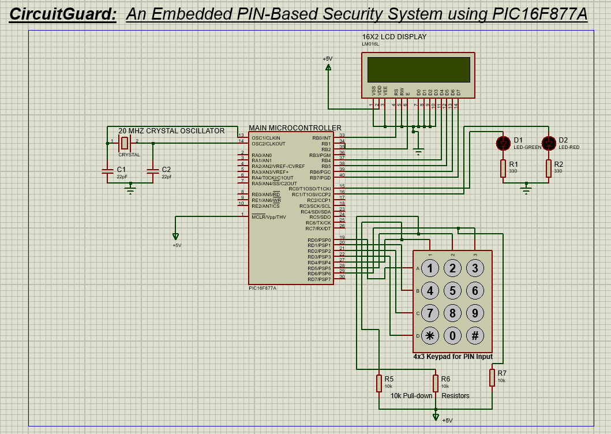
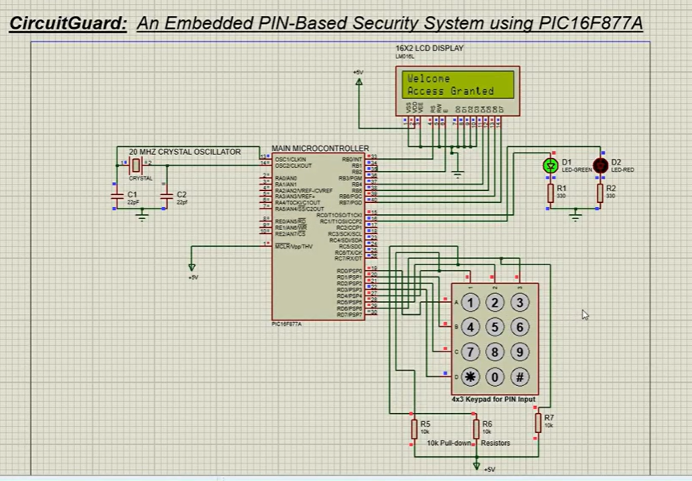

Password-based lock system using PIC16F877A simulated on Proteus
# 🔐 CircuitGuard

A simulation-based embedded password lock system developed using **PIC16F877A**, designed and tested on **Proteus** as part of my internship at **Keltron Knowledge Centre, Kozhikode**.

---

## 📌 Features

- Password entry via 4x3 Keypad  
- 16x2 LCD interface in 4-bit mode  
- Green/Red LED indications  
- 3 wrong attempts = system lock (with delay)  
- Clear display messages for each state  

---

## ⚙️ Tech Stack

- **PIC16F877A Microcontroller**  
- **MPLAB IDE (Embedded C)**  
- **Proteus 8.9** (Simulation only)  

---

## 🖼️ Circuit Preview

Circuit before turning the simulation on:

Circuit when the right password is given:
  

---

## 🎥 Simulation Video

[📺 Watch the CircuitGuard simulation video](<https://drive.google.com/file/d/1rLBct0EhoUBXl7SiQaQ-xzD3Z8qEhbHd/view?usp=sharing>)

---

## 👩‍💻 Author

**Shreya S N**  
BTech ECE | GECK | APJAKTU  
Intern at Keltron Knowledge Centre, Kozhikode 
2025  

